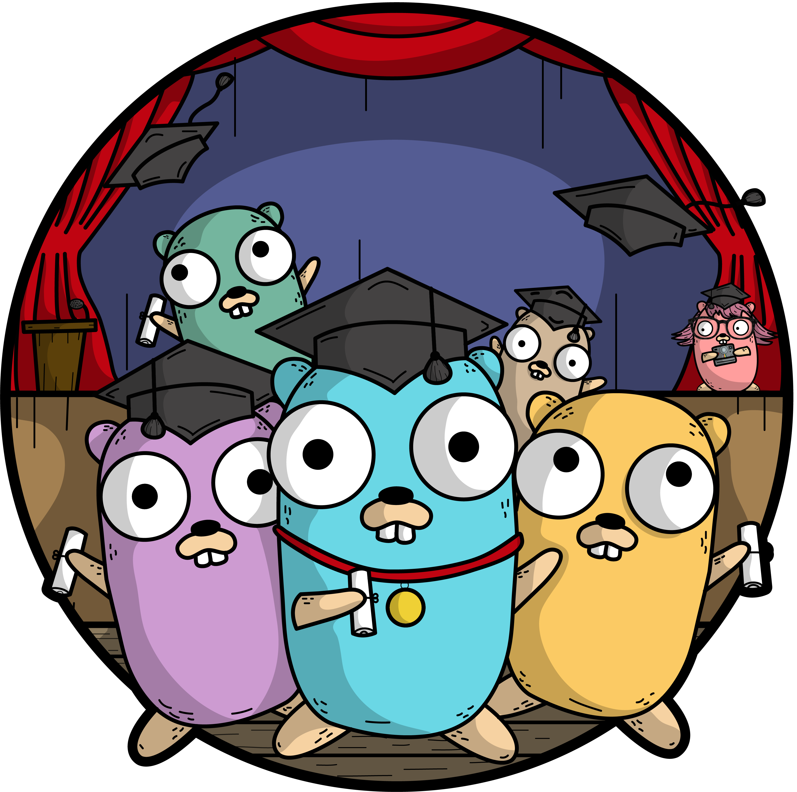

# noty

## 🧑‍🔬 About

A simple notification application built using Redis and WebSocket.

## 🙌 Getting started

### 📚 Table of contents

1. [Documentation](#📝-documentation).
2. [Requirements](#🧰-requirements).
3. [Local development](#💻-local-development).
    * [Setting up pre-commit hooks](#🪝-setting-up-pre-commit-hooks).
    * [Setting up environment variables](#🔒-setting-up-environment-variables).
    * [Running server locally](#🏃‍♂️-runing-server-locally).
4. [Testing](#🧪-testing).
5. [Linting](#👀-linting).

### 📝 Documentation

You can manually view the Swagger specification in the [api/](api/) directory or view it at http://localhost:8080/swagger/index.html if the server is running locally.

### 🧰 Requirements

* [pre-commit v2.20.0](https://pre-commit.com/#installation)
* [golangci-lint v1.50.1](https://golangci-lint.run/usage/install/)
* [Docker v20.10.17](https://docs.docker.com/engine/install/)

### 💻 Local development

For local development, you need to repeat the following steps. 👇

1. [Setting up pre-commit hooks](#🪝-setting-up-pre-commit-hooks).
2. [Setting up environment variables](#🔒-setting-up-environment-variables).
3. [Running server locally](#🏃‍♂️-runing-server-locally).

#### 🪝 Setting up pre-commit hooks

To install the pre-commit hooks, run the `pre-commit install` command and check the installation with the `pre-commit run` command.

#### 🔒 Setting up environment variables

To set up environment variables, you need to create a **local.env** file with the environment variables from the [example.env](example.env) file.

#### 🏃‍♂️ Runing server locally

Once you [set up environment variables](#-setting-up-environment-variables), you can use the `make local-run` command, which creates a docker image and runs the server in the docker container.

### 🧪 Testing

To run tests, use `make test` command.

### 👀 Linting

To run linters, use `make lint` command.
